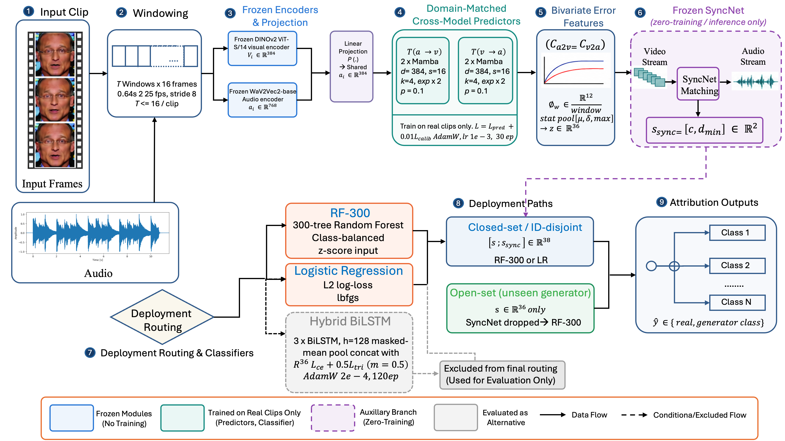

# SAGA

**Domain-Matched Predictor Adaptation and Off-the-Shelf Audio-Visual Synchrony Scoring for Deepfake Attribution**

This repository contains the reference implementation accompanying the paper of the same name. SAGA attributes a manipulated audio-visual clip to its generating method (not just "real" vs. "fake") using two complementary, largely training-data-free signal sources:

1. **Domain-matched cross-modal predictors.** Two small Mamba-based predictors, `T_a2v` and `T_v2a`, are trained on *real, unmanipulated clips only* to predict one modality's frozen features (DINOv2 for video, wav2vec2 for audio) from the other's. No fake data is used to train them. The paper's central methodological finding is that this only works if the predictors are adapted on the *evaluation dataset's own* real training clips — adapting on a different dataset and applying the predictors zero-shot causes the resulting signal to collapse toward chance.
2. **An off-the-shelf audio-visual synchrony scorer.** The original, frozen SyncNet model (Chung & Zisserman, 2016) is used purely for inference — zero additional training — to contribute two synchrony scalars per clip.

The two feature sources are combined and routed to a classifier (RF-300, Logistic Regression, or a Hybrid BiLSTM) chosen according to the deployment setting: closed-set / identity-disjoint attribution among known generators, or open-set detection of a previously unseen generator. The paper reports, rather than hides, a real tradeoff — synchrony features help closed-set attribution substantially and consistently hurt open-set detection of an unseen generator — and recommends different feature configurations for each case.

## Architecture



Nine stages, from a raw input clip to an attribution decision: windowing → frozen DINOv2/wav2vec2 encoders → the domain-matched cross-modal predictors → the 12-d/36-d error-curve features → the frozen SyncNet branch → the candidate classifiers → deployment routing (closed-set vs. open-set) → the final attribution output. See the paper's Section 3 for the full derivation, and `figures/arch_saga.png` for a higher-level overview of the same pipeline.

## Results

RF-300 binary AUC, in-domain vs. out-of-domain predictor adaptation, 3-seed mean ± std (Table 1):

| Evaluated on | In-domain | Out-of-domain |
|---|---|---|
| FakeAVCeleb | 69.1 ± 0.7% | 66.4 ± 0.2% |
| LAV-DF | 55.4 ± 1.6% | 48.1 ± 0.7% |

Attribution performance across all four evaluation protocols and six configurations (Table 2, closed-set columns):

| Configuration | Random-split AUC | Identity-disjoint AUC | Open-set FSGAN AUROC | Open-set Wav2Lip AUROC |
|---|---|---|---|---|
| RF-300 (no sync) | 69.1 ± 0.7% | 51.8 ± 0.5% | **58.1 ± 0.4%** | **64.0 ± 0.3%** |
| RF-300 (+ sync) | 73.3 ± 0.5% | 59.4 ± 0.3% | 55.3 ± 0.9% | 51.6 ± 1.1% |
| Hybrid BiLSTM (+ sync) | 71.3 ± 1.1% | 61.6 ± 5.7% | 41.1 ± 1.4% | 41.8 ± 3.5% |
| Logistic Regression (+ sync) | **74.9%** | **67.5%** | 46.3% | 62.6% |

No single configuration wins every column — the strongest closed-set numbers come from the simplest classifier evaluated (plain Logistic Regression), while RF-300 without synchrony features is the most robust choice when an unseen generator may appear at test time. See the paper's Section 5–6 for the full protocol-by-protocol breakdown, feature-importance analysis, paired-bootstrap significance tests, and the mechanistic account of why synchrony features help one setting and hurt the other.

## Repository structure

```
saga/
  data/            sliding-window datasets: real-only adaptation, cached error-curve loading
  models/          frozen encoders, Mamba cross-modal predictors, Hybrid BiLSTM, SyncNet wrapper
  features/        bivariate error curve -> 12-d/36-d feature construction
  training/        predictor adaptation loop, classifier training loop, loss functions
  baselines/       RF-300, Logistic Regression, raw-SyncNet-threshold baselines
  evaluation/      flat-feature extraction, paired bootstrap significance, latency benchmarking
scripts/           CLI entry points wiring the package together end to end (see below)
configs/           YAML hyperparameters matching the paper exactly
external/syncnet/  third-party SyncNet architecture (MIT-licensed; checkpoint not redistributed)
figures/           architecture diagrams and result plots referenced above
```

## Installation

```bash
python -m venv .venv && source .venv/bin/activate
pip install -r requirements.txt
```

`mamba-ssm` requires a CUDA GPU; on a CPU-only machine, `saga.models.predictors` transparently falls back to a single-layer GRU per block so the pipeline still runs end to end (useful for debugging, not for reproducing the paper's numbers). `decord` is used for fast video frame access with an OpenCV fallback; `ffmpeg` must be on your `PATH` for audio extraction.

SyncNet's checkpoint (~55MB) is not committed to this repository — see `external/syncnet/SOURCE.md` for where to download it.

## Data

None of the datasets used in the paper (FakeAVCeleb, DF-TIMIT, LAV-DF) are redistributed here; they are publicly available academic benchmarks obtainable from their original sources. Every script in this repository consumes a simple metadata CSV you produce from wherever you've placed those datasets, with (at least) these columns:

| column | meaning |
|---|---|
| `uid` | unique clip identifier |
| `split` | `train`, `val`, or `test` |
| `generator_id` | `0` for real, `1..k` for each fake generator |
| `video_path` | path to the clip (single muxed audio-video file) |

## Reproducing the pipeline

```bash
# 1. Adapt the cross-modal predictors on the target dataset's own real training clips
python scripts/adapt_predictor.py --config configs/predictor_adapt.yaml \
    --meta-csv data/error_meta.csv --output-dir runs/predictor_adapt

# 2. Cache the resulting per-clip error curves
python scripts/precompute_error_curves.py --meta-csv data/error_meta.csv \
    --checkpoint runs/predictor_adapt/best.pt --cache-dir data/cached_errors

# 3. Score every clip with the frozen, off-the-shelf SyncNet model
python scripts/precompute_syncnet_features.py --meta-csv data/error_meta.csv \
    --checkpoint external/syncnet/syncnet_v2.model --output data/sync_features.json

# 4. Evaluate the RF-300 / Logistic Regression / raw-SyncNet-threshold baselines
python scripts/evaluate.py closed-set --meta-csv data/error_meta.csv \
    --cache-dir data/cached_errors --sync-features data/sync_features.json \
    --output results/random_split.json

# 5. Train the Hybrid BiLSTM classifier
python scripts/train_classifier.py --config configs/hybrid_bilstm.yaml \
    --meta-csv data/error_meta.csv --cache-dir data/cached_errors \
    --sync-features data/sync_features.json --output-dir runs/hybrid_bilstm

# 6. Paired-bootstrap significance test between any two configurations
python scripts/run_significance.py --meta-csv data/error_meta.csv \
    --cache-dir data/cached_errors --sync-features data/sync_features.json \
    --clf-a logreg --sync-a --clf-b rf300 --sync-b --output results/significance.json

# 7. Single-clip inference latency benchmark
python scripts/run_latency.py --meta-csv data/error_meta.csv \
    --cache-dir data/cached_errors --sync-features data/sync_features.json \
    --output results/latency_benchmark.json
```

For the **open-set** protocols, pass a training CSV whose rows already exclude the held-out generator and a separate test CSV that includes it:

```bash
python scripts/evaluate.py open-set --meta-csv data/error_meta_openset_train.csv \
    --test-meta-csv data/error_meta_openset.csv --cache-dir data/cached_errors \
    --sync-features data/sync_features.json --held-out-label 3 \
    --output results/openset_fsgan.json
```

For the identity-disjoint protocol, produce a metadata CSV whose `split` column already reflects an identity-disjoint partition and pass it to steps 1, 2, and 4 as usual.

## Third-party components

- **DINOv2** (ViT-S/14) and **wav2vec2-base** are loaded frozen via `timm` and `transformers` respectively, downloaded automatically on first use.
- **SyncNet** architecture and checkpoint: Chung & Zisserman, *"Out of Time: Automated Lip Sync in the Wild,"* ACCV 2016 Workshop. Code mirrored from [joonson/syncnet_python](https://github.com/joonson/syncnet_python) (MIT License) — see `external/syncnet/SOURCE.md`.
- **Mamba**: Gu & Dao, *"Mamba: Linear-Time Sequence Modeling with Selective State Spaces,"* 2023, via the [`mamba-ssm`](https://github.com/state-spaces/mamba) package.

## License

MIT — see `LICENSE`. Third-party components retain their own licenses (see above).
